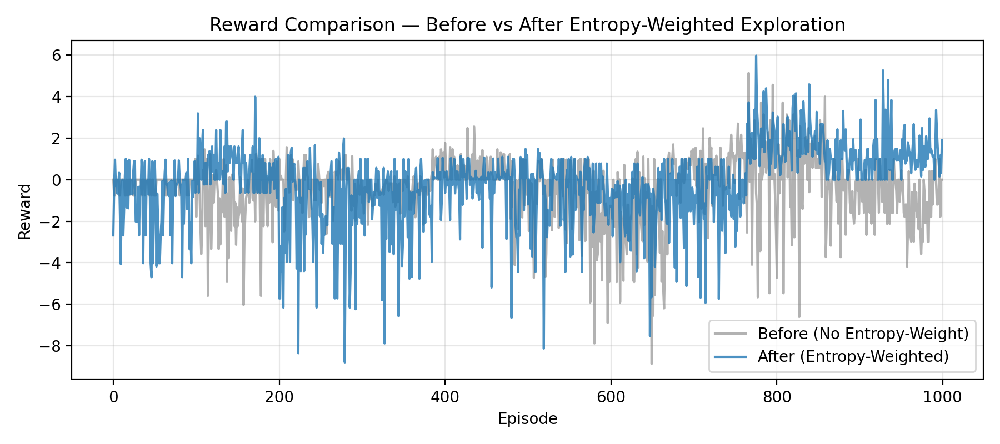
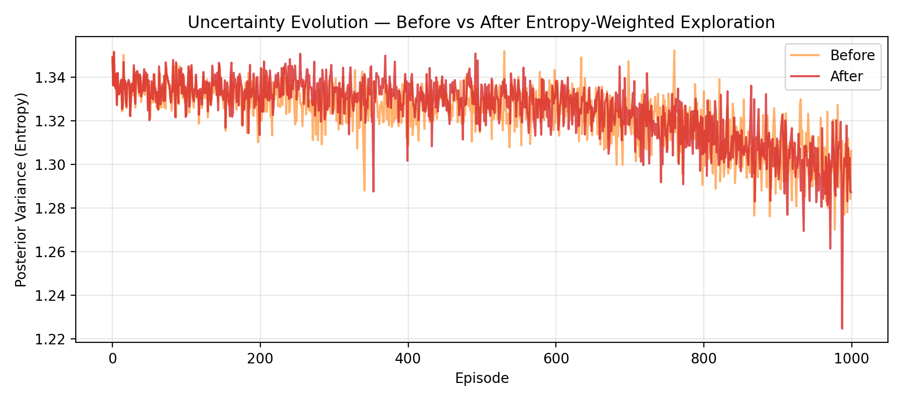

# ReMetaBayes
**Entropy-Weighted Probabilistic RL for Autonomous Adaptation under Non-Stationarity**

[](#license)


[]()

> A minimal, research-grade RL framework where **policy entropy controls exploration temperature**.  
> Result: smoother learning, entropy decay, and improved mean reward under distribution shift.

---

## ✨ Key Results (GridWorldShift, 1000 eps)
- **Mean reward**: baseline **−0.405** → ReMetaBayes **−0.177** (**+0.228** ↑)
- **Entropy drift**: **1.34 → 1.28** (policy confidence ↑)
- **Adaptation gain** (last100 − first100): **+0.19**

<p align="center">
  
  
</p>

---

## 🔧 Installation
```bash
git clone <YOUR-REPO-URL> remetabayes
cd remetabayes
python -m venv venv && source venv/bin/activate
pip install -r requirements.txt  # or: pip install torch numpy pyyaml matplotlib tqdm
````

---

## 🚀 Quickstart

Train on **GridWorldShift** (entropy-weighted version):

```bash
python train_meta.py --config experiments/run_gridworld.yaml
python visualize_results.py
```

Train **baseline** (no entropy weighting) to create comparison logs:

```bash
# 1) run baseline by temporarily disabling temperature scaling in `core/agents/bayesian_agent.py`:
#    probs = softmax(logits)   # comment out temperature lines
python train_meta.py --config experiments/run_gridworld.yaml
mkdir -p results/gridworld_baseline
mv results/gridworld/metrics.json results/gridworld_baseline/

# 2) re-enable entropy weighting, retrain:
#    temperature = 1.0 + entropy; probs = softmax(logits / temperature)
python train_meta.py --config experiments/run_gridworld.yaml
python compare_entropy_effect.py
```

there is new update and new command will be look like : 
```
rm results_meta/remetabayes_meta_metrics.json


python train_meta.py --config experiments/run_gridworld_meta.yaml


python plot_results.py
```

Artifacts are saved to:

```
results/gridworld/metrics.json
results/gridworld_baseline/metrics.json
results/plots/*.png
```

---

## 📂 Project Structure

```
ReMetaBayes/
├── core/
│   ├── agents/        # base_agent.py, bayesian_agent.py, meta_agent.py
│   ├── envs/          # gridworld_shift.py, contextual_bandit.py, cartpole_drift.py
│   ├── theory/        # derivation.tex, regret_bound.pdf (notes)
│   └── utils/         # logger, helpers
├── experiments/       # *.yaml configs + wandb_config.json
├── notebooks/         # optional visualization notebooks
├── results/           # JSON logs + plots
├── train_meta.py      # main training entry
├── visualize_results.py
├── compare_experiments.py
├── compare_entropy_effect.py
├── README.md | LICENSE | CITATION.cff
```

---

## 📊 Metrics

* **Mean reward** (episode average)
* **Uncertainty (entropy)** — mean per episode
* **Adaptation gain** = mean(last 100) − mean(first 100)
* **KL/Drift** (optional hook)

---

## 🧪 Reproducibility

* Deterministic seeds in YAML (`experiment.seed`)
* Logs as JSON, figures regenerated from scripts
* CPU/MPS friendly (no CUDA required)

---

## 📝 Paper

Preprint (Elsevier 5p): *ReMetaBayes — Entropy-Weighted Probabilistic Reinforcement Learning for Autonomous Adaptation under Non-Stationarity*.
Put the PDF under `papers/` or link a DOI here once minted.

---

## 🖊️ Citation

If you use this project, please cite:

```bibtex
@misc{octaviani2025remetabayes,
  title   = {ReMetaBayes: Entropy-Weighted Probabilistic RL for Autonomous Adaptation under Non-Stationarity},
  author  = {Aulia Octaviani},
  year    = {2025},
  url     = {<REPO-URL>},
  note    = {Code and results; see README for reproducibility}
}
```

---

## 📜 License

MIT — see [LICENSE](LICENSE).

---

````
